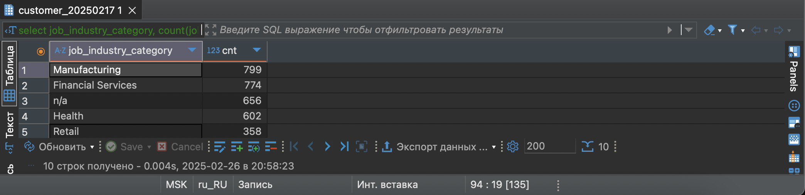
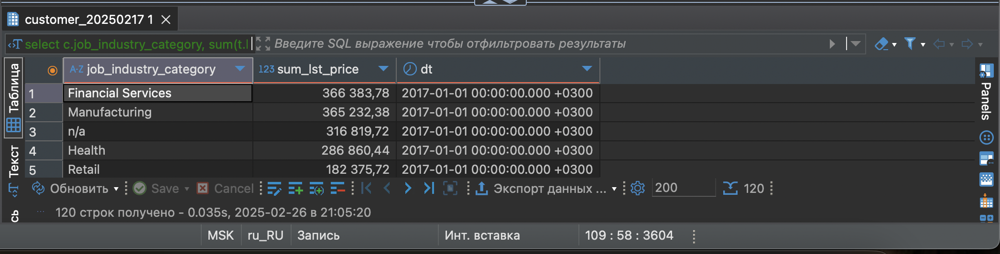
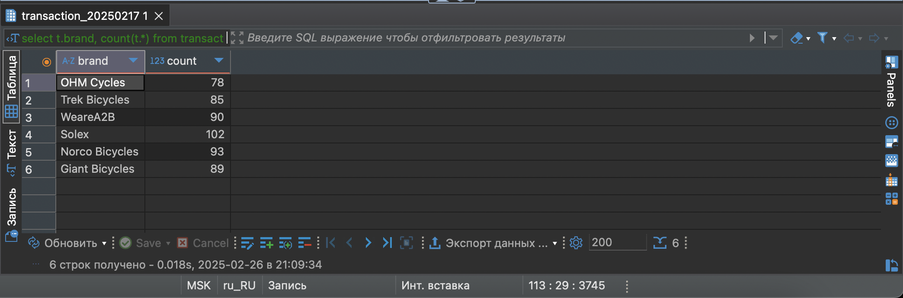
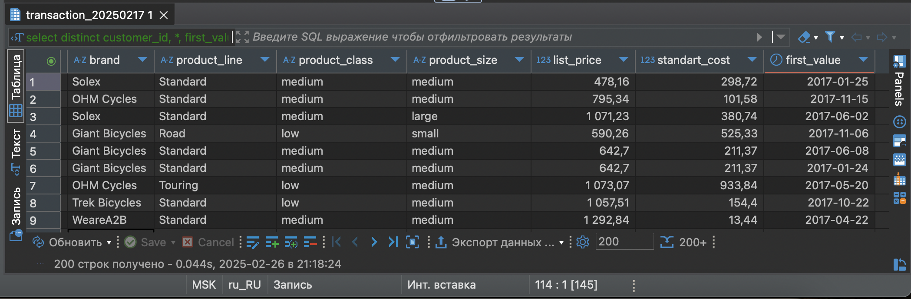

# Домашняя работа 3

## Группировка данных и оконные функции.


### Вывести распределение (количество) клиентов по сферам деятельности, отсортировав результат по убыванию количества

```sql
select job_industry_category
       ,count(job_industry_category) cnt
from customer_20250217
group by job_industry_category
order by cnt desc;
```


### Найти сумму транзакций за каждый месяц по сферам деятельности, отсортировав по месяцам и по сфере деятельности

```sql
select c.job_industry_category
       ,sum(t.list_price) sum_lst_price
       ,date_trunc('month', to_date(t.transaction_date, 'DD.MM.YYYY')) dt
from customer_20250217 c 
join transaction_20250217 t on t.customer_id = c.customer_id
where coalesce(c.job_industry_category, '')  <> ''
group by dt, c.job_industry_category
order by dt, sum_lst_price desc;
```



### Вывести количество онлайн-заказов для всех брендов в рамках подтвержденных заказов клиентов из сферы IT

```sql
select t.brand
       ,count(t.brand)
from transaction_20250217 t
join customer_20250217 c on c.customer_id = t.customer_id
where t.online_order = 'True' and c.job_industry_category = 'IT' and coalesce(t.brand, '') <> ''
group by t.brand;
```



### Вывести только самые первые транзакции клиентов. Решить с помощью оконных функций.

```sql
select distinct customer_id, *, 
       first_value(to_date(transaction_date, 'DD.MM.YYYY')) over (partition by customer_id)
from transaction_20250217 t 
```



### Найти по всем клиентам сумму всех транзакций (list_price), максимум, минимум и количество транзакций, отсортировав результат по убыванию суммы транзакций и количества клиентов.

```sql
with transact_agg as (
	select t.customer_id,
           sum(list_price) sum_lp,
           max(list_price) max_lp, 
           min(list_price) min_lp, 
           COUNT(*) cnt
	from transaction_20250217 t 
	group by customer_id
	order by sum_lp desc
)
select c.customer_id , 
       c.first_name, 
       c.last_name, t.sum_lp, 
       t.max_lp, 
       t.min_lp, 
       t.cnt
from customer_20250217 c 
join transact_agg t on t.customer_id = c.customer_id
order by cnt desc;
```

```sql
select c.customer_id , 
       c.first_name, c.last_name, 
       sum(t.list_price) sum_lp, 
       max(t.list_price) max_lp, 
       min(t.list_price) min_lp, 
       count(t.*)cnt
from customer_20250217 c 
join transaction_20250217 t on t.customer_id = c.customer_id
group by c.customer_id 
order by cnt desc, sum_lp desc;
```

```sql
select distinct t.customer_id,c.first_name, c.last_name,
	   sum(t.list_price) over (partition by t.customer_id) as sum_lp,
	   min(t.list_price) over (partition by t.customer_id) as min_lp,
	   max(t.list_price) over (partition by t.customer_id) as max_lp,
	   count(t.*) over (partition by t.customer_id) as cnt
from  transaction_20250217 t
join customer_20250217 c on t.customer_id = c.customer_id
order by cnt desc, sum_lp desc;
```

### Найти имена и фамилии клиентов с минимальной/максимальной суммой транзакций за весь период (сумма транзакций не может быть null). Напишите отдельные запросы для минимальной и максимальной суммы

```sql
with transact_sum as (
	select t.customer_id, sum(t.list_price) sum_lp
	from transaction_20250217 t 
	group by t.customer_id
)
select c.first_name, c.last_name, ts.sum_lp
from customer_20250217 c 
join transact_sum ts  on ts.customer_id = c.customer_id
where ts.sum_lp  = (
	select max(sum_lp)
	from transact_sum 
) and ts.sum_lp is not null
```

```sql
with transact_sum as (
	select t.customer_id, sum(t.list_price) sum_lp
	from transaction_20250217 t 
	group by t.customer_id
)
select c.first_name, c.last_name, ts.sum_lp
from customer_20250217 c 
join transact_sum ts  on ts.customer_id = c.customer_id
where ts.sum_lp  = (
	select min(sum_lp)
	from transact_sum 
) and ts.sum_lp is not null
```

### Вывести имена, фамилии и профессии клиентов, между транзакциями которых был максимальный интервал (интервал вычисляется в днях) 

```sql
with transaction_dates as (
select customer_id, to_date(transaction_date, 'DD.MM.YYYY') cur_date, 
	   lead(to_date(transaction_date, 'DD.MM.YYYY')) over (partition by customer_id
	   order by to_date(transaction_date, 'DD.MM.YYYY')) as next_date,
	   lag(to_date(transaction_date, 'DD.MM.YYYY')) over (partition by customer_id
	   order by to_date(transaction_date, 'DD.MM.YYYY')) as prev_date
from transaction_20250217 t  
), transaction_intervals as (
	select customer_id, cur_date, next_date,
	((next_date) - (cur_date)) as interval
	from transaction_dates 
)
select c.first_name, c.last_name, c.job_title, 
	max(t."interval") over (partition by c.customer_id) as max_interval
from customer_20250217 c 
join transaction_intervals t on t.customer_id = c.customer_id
where interval is not null
order by interval desc
```


